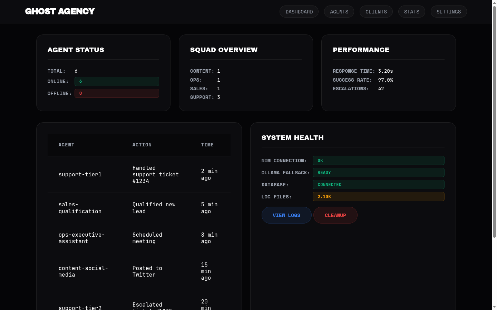
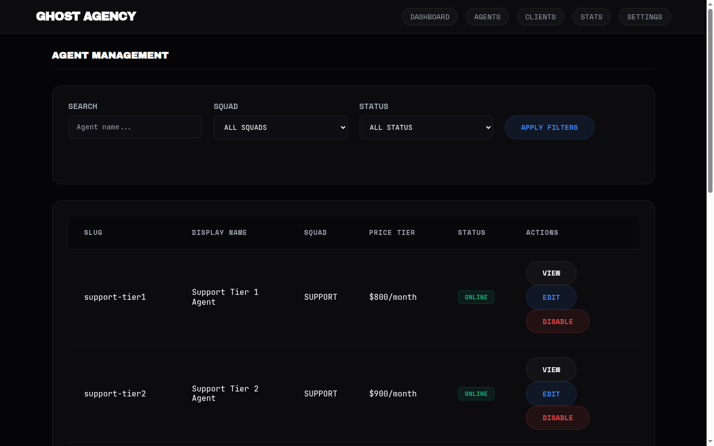
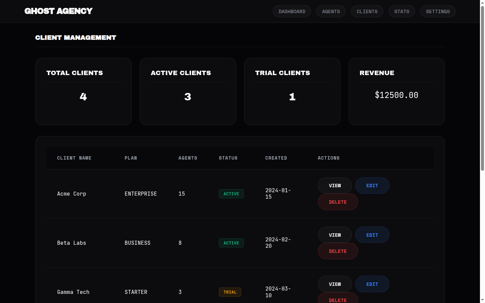
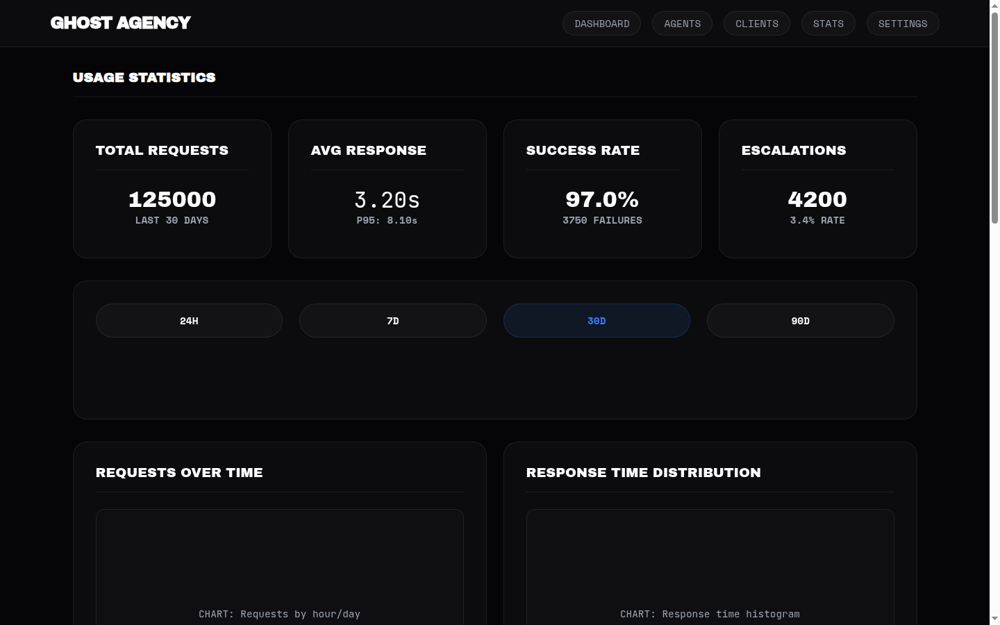
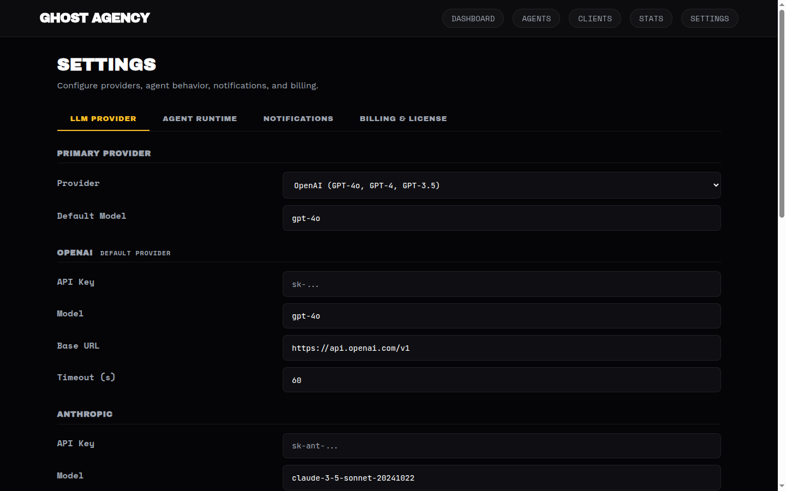
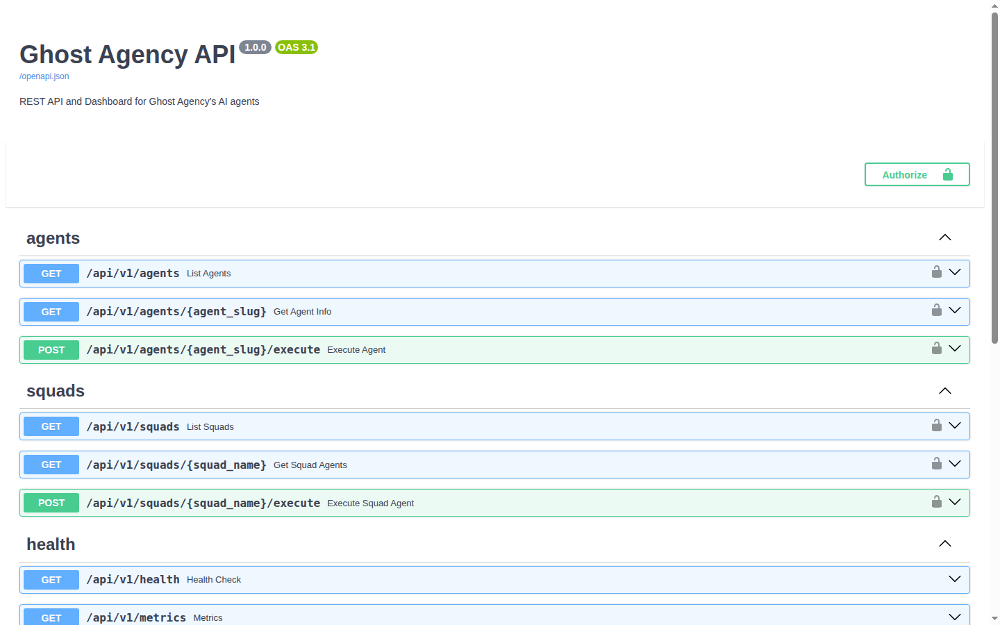

# Ghost Agency

**AI employee platform** — deploy specialized AI agents for businesses at $500–$2,500/mo per seat. Built for solo operators and agencies.

[Business plan](GHOST_AGENCY.md) · [Developer guide](AGENTS.md) · [Demo](#quick-start)

---

## Overview

<p align="center">
  
</p>

Ghost Agency is an **AI Workforce-as-a-Service** platform with a Glass Brutalism dashboard, multi-provider LLM support, and 6 specialized AI agents (scaling to 156+). Each agent acts as a virtual employee — handling support tickets, qualifying leads, creating content, and more.

---

## Dashboard Screenshots

<table>
  <tr>
    <td align="center"><b>Dashboard</b></td>
    <td align="center"><b>Agents</b></td>
  </tr>
  <tr>
    <td></td>
    <td></td>
  </tr>
  <tr>
    <td align="center"><b>Clients</b></td>
    <td align="center"><b>Stats</b></td>
  </tr>
  <tr>
    <td></td>
    <td></td>
  </tr>
</table>

<details>
<summary><b>Settings & API Documentation</b></summary>

<br>
<b>Settings Page</b><br>

<br><br>
<b>API Documentation (Swagger)</b><br>

</details>

---

## Quick Start

```bash
git clone https://github.com/ravikumarve/GhostAgency.git
cd GhostAgency
python3 -m venv .venv && source .venv/bin/activate
pip install -r requirements.txt
cp .env.example .env   # add your NIM API key

# Run the demo (mock mode, no AI calls needed)
PYTHONPATH=. GHOST_MOCK_AI=true python ghostagency/demo/run_demo.py
```

See all available agents:
```bash
PYTHONPATH=. python ghostagency/scripts/list_agents.py
```

Launch the dashboard:
```bash
PYTHONPATH=. uvicorn ghostagency.api.main:app --host 0.0.0.0 --port 8000
# Open http://localhost:8000
```

---

## AI Workforce

| Department | Agents | Price/mo | Capability |
|---|---|---|---|
| Support | 3 | $600–900 | Tickets, billing, technical help |
| Sales | 1 | $900–1,500 | Lead qualification, outreach |
| Content | 1 | $500–800 | Social media, blog, SEO |
| Operations | 1 | $1,200–2,000 | EA, scheduling, projects |
| Data | — | Coming soon | Research, analytics, reporting |
| Dev | — | Coming soon | Code review, QA, technical support |
| Finance | — | Coming soon | Invoicing, expense tracking |
| HR | — | Coming soon | Recruitment, onboarding |
| Legal | — | Coming soon | Contract review, compliance |
| Custom | — | Custom | Client-specific agents |

**Current total: 6 agents** — built to scale to 156+ specialized roles.

---

## Architecture

```
Client → Agent Registry → AI Agent → Knowledge Base → LLM → Response
```

| Layer | Technology |
|---|---|---|
| LLM | OpenAI (default) · Anthropic · Gemini · NVIDIA NIM · Ollama |
| API | FastAPI · REST · async |
| Auth | License key + API key middleware |
| Rate limiting | In-memory per-key throttling |
| Settings | SQLite key-value store with runtime overrides |
| UI | Glass Brutalism · Jinja2 · CSS animations |
| Logging | Structured JSON per interaction |
| Packaging | Install script · `.env.example` · LICENSE |

### Config

Select provider via `LLM_PROVIDER` env var or the Settings page at `/settings`. Example switching to Anthropic:

```env
LLM_PROVIDER=anthropic
ANTHROPIC_API_KEY=sk-ant-...
```

See [.env.example](.env.example) for all options.

---

## Production

```bash
uvicorn ghostagency.api.main:app --host 0.0.0.0 --port 8000
```

---

## Testing

```bash
pytest                                # all tests
pytest --cov=ghostagency              # with coverage
pytest tests/squads/test_squad_support.py -v  # single squad
```

---

## Adding Agents

Create a new agent in the appropriate `squad_*` directory, register it in `ghostagency/core/agent_registry.py`, and validate:

```bash
python ghostagency/scripts/validate_registry.py
```

See [AGENTS.md](AGENTS.md) for full development guide.

---

## Install

```bash
# After cloning:
bash install.sh
```

---

## Status

- **6 agents** deployed across 4 squads
- **91/91 tests** passing
- **Core coverage** 100% · Overall 47%
- **5 LLM providers** — OpenAI, Anthropic, Gemini, NIM, Ollama
- **Settings page** with SQLite persistence
- **Glass Brutalism UI** with landing page + dashboard
- **Ready** for single-tenant deployment

---

*Ghost Agency — Turn AI into your invisible workforce.*
